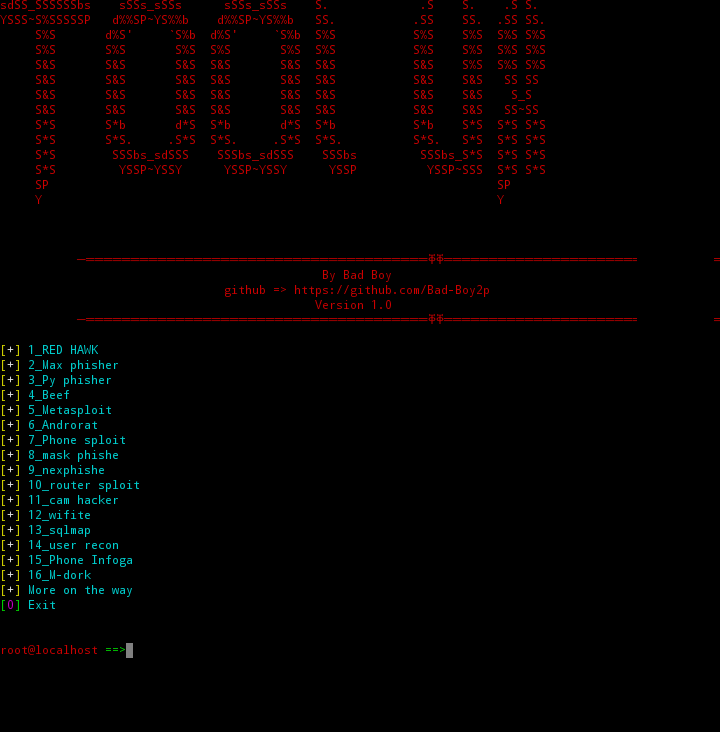

# VX Tool 🦂


### Description

a powerful and effective tool to download the most famous penetration testing tools and solve all problems

# Note ⚠️
+ the tool need data connection or wifi for run and install requirements 

## Tested on 
+ Kali Linux ✓
+ Termux ✓

# Installation

### Kali linux 

```
sudo apt update -y
sudo apt upgrade -y
sudo apt install git python -y
git clone https://github.com/Bad-Boy2p/VXTool
cd VXTool
chmod +x setup.sh main.py
sudo bash setup.sh
sudo python3 main.py
```
### Termux

```
pkg update -y
pkg upgrade -y
pkg install git python -y
git clone https://github.com/Bad-Boy2p/VXTool
cd VXTool
chmod +x setup.sh main.py
bash setup.sh
python3 setup.sh
```
# How to use ?

+ Screenshot 📸
 

#### Choose from the selection list

# By Bad Boy 

